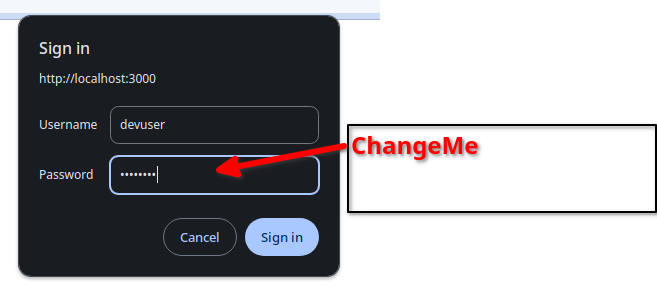

# Public Cloud Access

You can either log into the existing Oppkey server or deploy
your own server.

## Live site: [https://r360.oppget.com/](https://r360.oppget.com/)

Contact Oppkey for login to our public cloud site to browse around.

## Example to Deploy on Vercel

The site above is deployed on Vercel. If you want to see the code we use
for deployment as a reference, contact Oppkey for an example showing
how to deploy to Vercel and protect the site with basic authentication login.

With login, the `secrets.env` needs to contain
the `OPPKEY_VIEWER_PASSWORD` and `OPPKEY_VIEWER_USERNAME`
environmental variable.

If you are stuck, we have a working example of the `secrets.env` file
[here](https://github.com/codetricity/oppkey-ricoh-viewer-credentials).
We will need to get authorization to send you the example file.

```text
OPPKEY_VIEWER_PASSWORD=ChangeMe
OPPKEY_VIEWER_USERNAME=devuser
SESSION_SECRET=93qBc2janrrGcwvOxIEth3RFgf31Cg0K
CLIENT_ID=<Your unique client id from RICOH Cloud API>
CLIENT_SECRET=<client secret for your client id for RICOH Cloud API>
PRIVATE_KEY="<long private key for the viewer>"
```

With the login example, the browser will open a sign in window.
You can change the credentials
in the `secrets.env` file for local testing.



The repository example includes deployment configuration
to Vercel, free plan.  If you deploy to the public
Vercel cloud, you must set the [environmental
variables in Vercel](https://vercel.com/docs/projects/environment-variables). A free alternative to Vercel is Netlify.  

### example vercel.json

```json
{
  "version": 2,
  "builds": [
    {
      "src": "./index.js",
      "use": "@vercel/node"
    }
  ],
  "routes": [
    {
      "src": "/(.*)",
      "dest": "/"
    }
  ]
}
```
