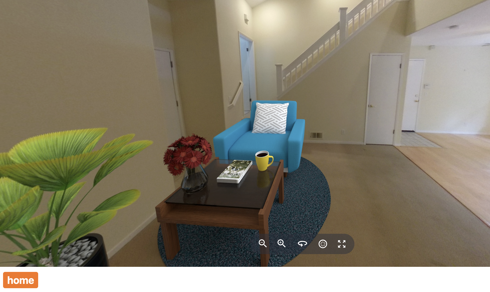
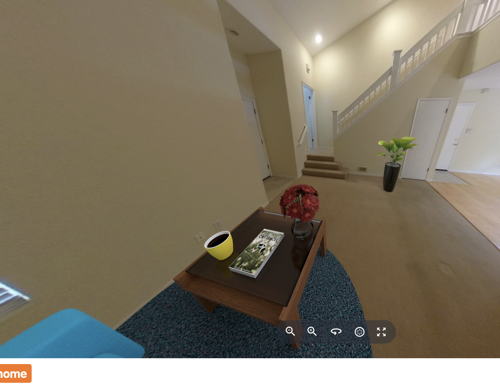

# Cloud API Direct Usage



The RICOH360 Viewer uses the RICOH360 Cloud API.
All the demonstrations use the content API to get a list
of images with their associated content_id.

This is an example of using the RICOH360 Cloud API to get
a listing of
40 images.  In the example below, `get_token_for_cloud_content()` is
a method that I made to access Amazon Cognito to get a RICOH360
Cloud token.

```python
# Function to query content from the RICOH360 API
def get_content():
    get_token_for_cloud_content()
    cloud_content_token = session["ricoh_cloud_token"]
    # Fetch content using the token
    content_headers = {"Authorization": f"Bearer {cloud_content_token}"}
    content_response = requests.get(
        "https://api.ricoh360.com/contents?limit=40", headers=content_headers
    )
    content_data = content_response.json()
    return content_data
```

When using the RICOH360 Viewer to do the transform, you
add the name of the transform, `enhancement`, after the property `transform`.

```javascript
viewer.switchScene(
    {
        contentId: contentId,
        transform: 'enhancement'
    }, "1"
)
```

Once the RICOH360 Viewer is set up, the API is nice and easy.
You can see from the example above, that the transform and placement
of the image to the right pane, index 1, is very easy.

Although the transformations such as enhancement are
in the viewer API, other transforms may require direct calls
to the Cloud API.

You can also do transforms that are not available through the
viewer.

This server-side example with Flask and Python requests module
shows how to do a transform to stage a room.

```python
content_response = requests.get(
    f"https://api.ricoh360.com/contents/{content_id}/staging:type_living_room", headers=content_headers
)
```



Full [source code is available on GitHub](https://github.com/theta360developers/oppkey-ricoh-viewer-demo-basic/tree/main/tutorial/practice/staging).

The demonstration uses a Python Flask backend with a Jinja HTML template
front-end.


## storing RICOH360 Viewer for multiple requests

To use the RICOH360 Viewer, a token is required.

This example uses the PyJWT package to generate a token
with the RICOH360 Viewer Private Key and Client ID.  The key and ID
must be obtained
from RICOH.  The Private Key is different from the Client Secret
used to get content from the RICOH360 Cloud API.

```python
from flask import Flask, render_template, request, session

def create_viewer_token():
    payload = {"client_id": CLIENT_ID}
    token = jwt.encode(payload, PRIVATE_KEY, algorithm="RS256")
    session["viewer_token"] = token
    # Decode to UTF-8 if necessary
    return token if isinstance(token, str) else token.decode("utf-8")
```

In the snippet above, I am storing the token in a Flask `session`.

To retrieve the token from the session, use the syntax `session["viewer_token"]`

`session` is a keyword from Flask that I imported.  `viewer_token` is the
variable name that I made to  hold the viewer token.

```python
@app.route("/livingroom")
def stage():
    content_id = request.args.get('contentId')
    staging_index = int(request.args.get('stagingIndex'))
    viewer_token = session["viewer_token"]
    cloud_token = session["ricoh_cloud_token"]
```

The staging transform returns an array of three different staging
placements.  In each of the three elements, the furniture is
placed in different areas of the living room.

To select a specifc placement, the HTML GUI passes an index
number to the `stage` method using a query.

```python
# print(f"cloud token: {cloud_token}")
content_headers = {"Authorization": f"Bearer {cloud_token}"}
content_response = requests.get(
    f"https://api.ricoh360.com/contents/{content_id}/staging:type_living_room", headers=content_headers
)
response_dict = content_response.json()
first_content_id = response_dict["results"][staging_index]["content_id"]
print(f"first content ID: {first_content_id}")
print(json.dumps(response_dict, indent=4, sort_keys=True))
return render_template("single_image.html",
                        token=viewer_token,
                        contentId=first_content_id,
                        )
```

Please refer to the GitHub example for the full code.
