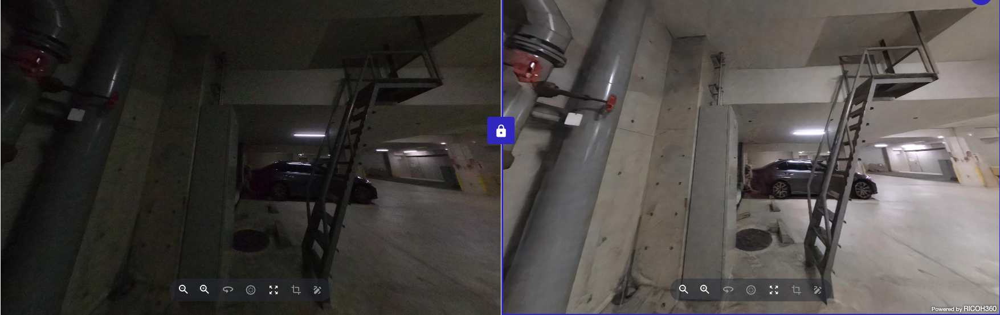
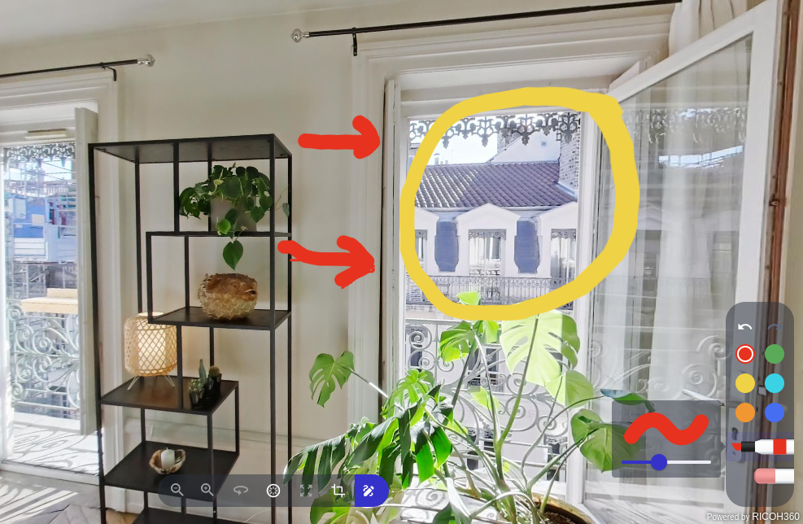
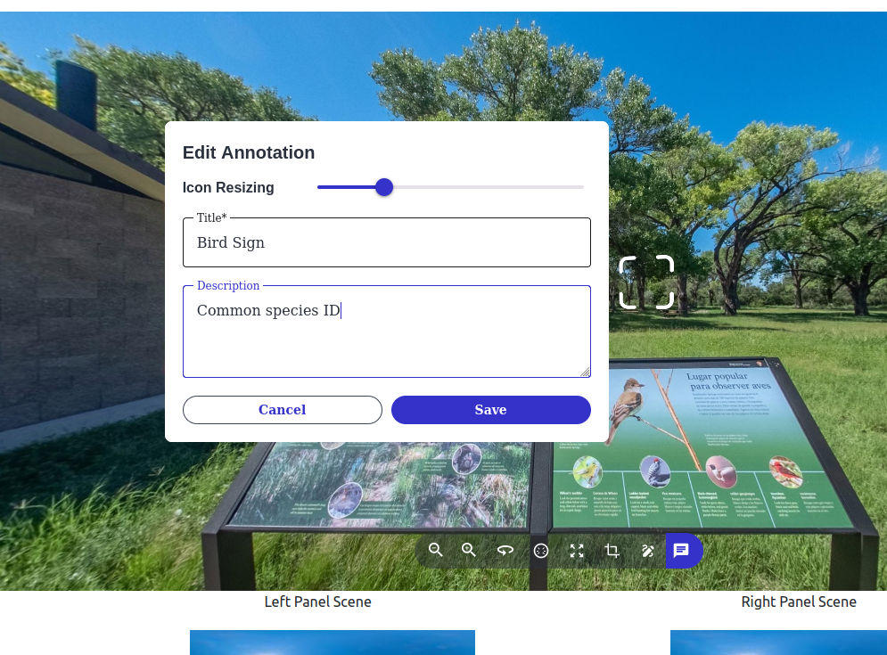
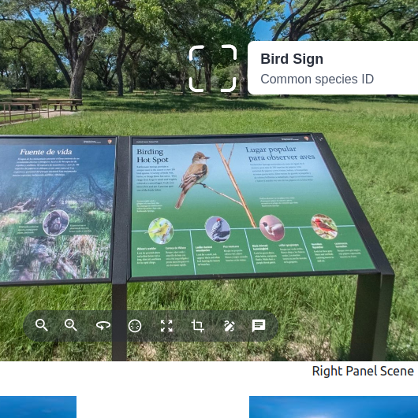
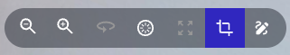
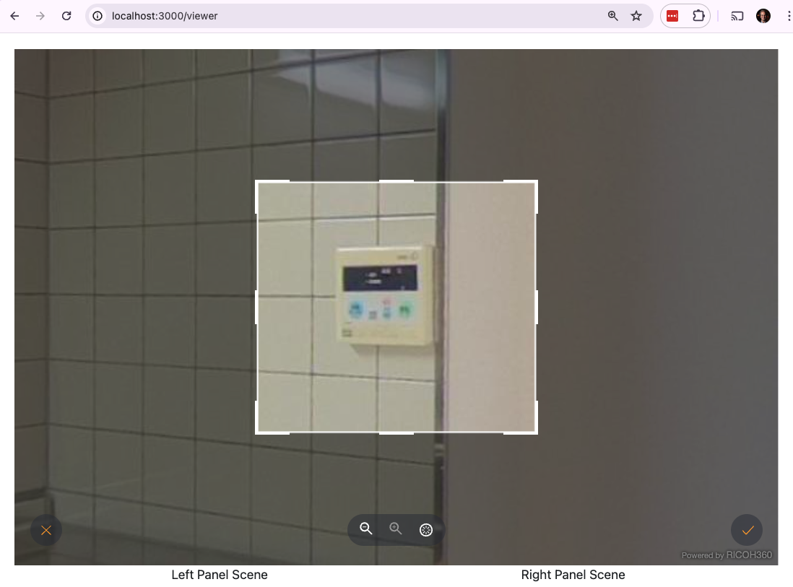
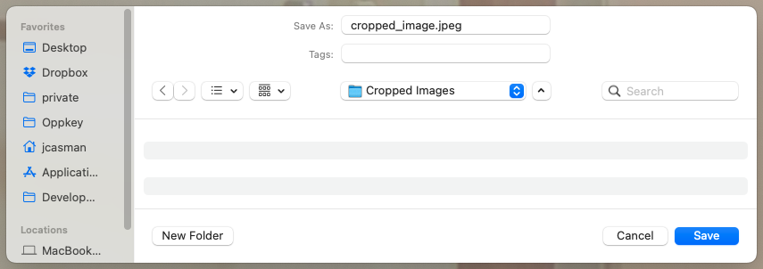

# Features

## Image Enhancement

This feature can improve image quality, especially resolution, noise, and color aberration.

Perform Low Light Enhancement on images with ISO 400 or higher. If the ISO sensitivity is set below 400, normal enhancement processing is performed. Uses API option `sr_lle_auto`.

Example 1: Dark interior Carlesbad Caverns National Park

Example 2: Dark interior car garage

## Split Screen

The RICOH360 Viewer can show a split screen view. Movement and zoom of the 2 images at the same time can be locked or unlocked.

## Navigation

Navigation controls at bottom of screen allow viewer to select Zoom In, Zoom Out, Auto Rotate, Home Position, Enter Full Screen, Enter Cropping, and Enter Drawing.

## Drawing

Drawings move with the image when the viewer is moved.  There
are an eraser, different color pens, and different line thicknesses.

Written notes and simple drawings appear in viewer.

## Annotation

You can use the keyboard to input an annotation and place
a rounded squarish icon in the scene that tells people that
there is more information available.  

Selecting the icon
will display the information on the picture.

## Cropping

Key portions of the 360° image can be cropped and saved locally.

Choose Enter Cropping

Select area

Cancel or Save Locally

Choose Location to Save Locally

## A Note on Demo UI

* Below the main image, there are two lists of images. Choose from the left list of images to pick the main viewer image. If you use the split screen, use the right list to choose the second image.

* To compare Low Light Enhancement, choose a dark image on the left. Choose the same dark image on the right. Click the Enhance button on the right image, showing Low Light Enhancement. 
* Note: If you want to test the Blur function, be sure to choose an image with people in it.
