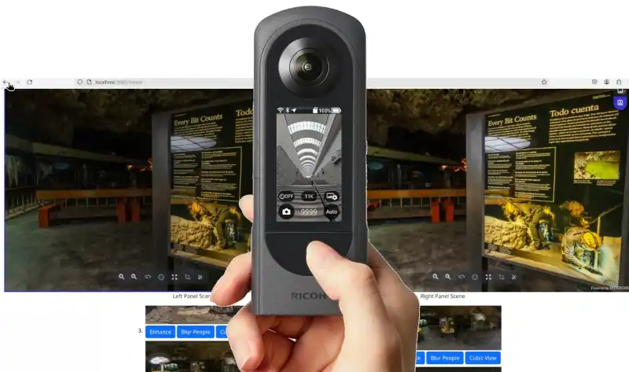

# Getting Started



The demo application requires  three pieces of information from friendly people at
RICOH.

1. Client ID
2. Client Secret
3. Private Key

In addition, it is recommended you get a username and
password for the partner technical documentation.

## Installation and Setup

1. clone down repo [oppkey-ricoh-viewer-demo-basic](https://github.com/theta360developers/oppkey-ricoh-viewer-demo-basic)
1. Install [Node.js](https://nodejs.org/en) - Note that Oppkey uses [nvm](https://github.com/nvm-sh/nvm) to manage node versions.  However, it may be simpler for you to install node straight from the node site.
1. In the root directory of the project, run `npm install`
1. create a `secrets.env` file in the project root. The file has this format:

```text
CLIENT_ID=<Your unique client id from RICOH Cloud API>
CLIENT_SECRET=<client secret for your client id for RICOH CLOUD API>
PRIVATE_KEY="<long private key for the viewer>"
```

Full `secrets.env` used by Oppkey is available [here](https://github.com/codetricity/oppkey-ricoh-viewer-credentials/blob/main/README.md). The
private key, client id, and client secret are in a private GitHub repo. If you are a RICOH staff or partner and have authorization to use the Oppkey client id, private key, and client secret, then contact Oppkey and we will send you the file. Otherwise, please use your own credentials you received from RICOH.

## Start Server

1. Run `npm run start`, the app should start locally on port 3000, `http://localhost:3000`
1. There are three buttons: community, documentation, viewer.  Click on the viewer button.


