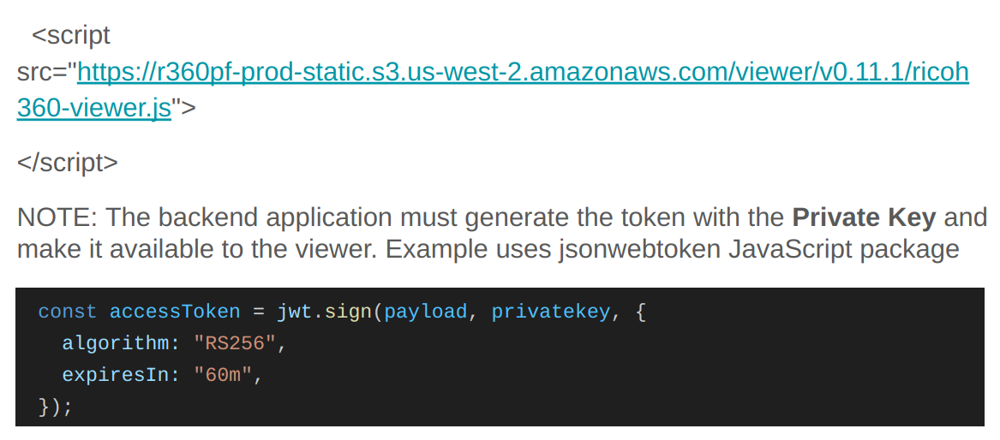
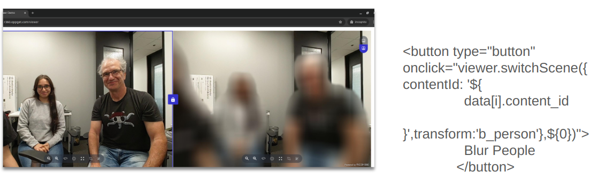

# Demo Overview

The demo is intended to be a live hosted site on AWS or Vercel. It consists of a backend server and a front end web application. The server can be run on a laptop with node.

---
## Process

---
## Step 1

### Go to Business Application Site

---
## Step 2

### Loading View in HTML

The token for the viewer is not the same as the token generated for the
RICOH360 Platform Content API.

---
## Step 3

### Generate Token for RICOH360 Platform API

---
## Step 4

### Use Viewer Blur API from Button

