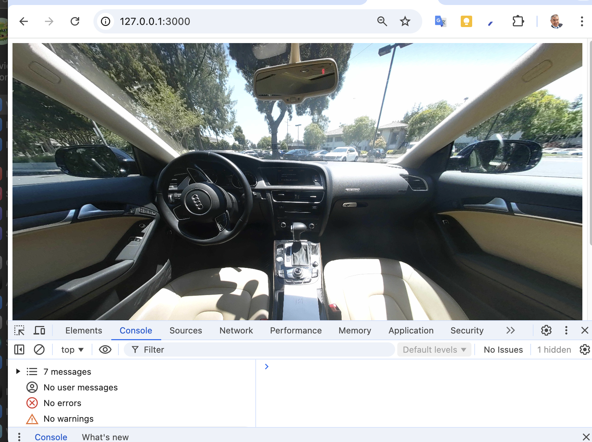

# RICOH360 Viewer Tutorial

This tutorial takes you from a blank file to the point
where you can display an image in a web browser.

There are two components: front-end and back-end.

| component | name | function |
| --- | ---- | ---- |
| front-end | index.html | load RICOH360 Viewer |
| back-end | server.py | send content to viewer and handle security |

Tutorial [code on GitHub](https://github.com/theta360developers/oppkey-ricoh-viewer-demo-basic/tree/main/tutorial)

## front-end HTML File

Create a barebones HTML file called `index.html`.

```html
<!DOCTYPE html>
<html lang="en">
<head>
    <meta name="viewport" content="width=device-width, initial-scale=1.0">
</head>
<body>
    
</body>
</html>
```

Insert the viewer in the head.

`<script src="https://r360pf-prod-static.s3.us-west-2.amazonaws.com/viewer/v0.15.0/ricoh360-viewer.js"></script>`

In the body, create a div with `id="viewer"`.

```html
<div
style="
    position: relative;
    width: 100%;
    height: 650px;
    background-color: #2a303c;
"
>
<div id="viewer"></div>
</div>
```

### instantiate viewer

In the snippet below, we will pass the token into the `index.html` from
Flask.

```javascript
  <script>
  const viewer = new RICOH360Viewer({
    divId: "viewer",
    onFetchToken: () => "{{token}}",
  });
</script>
```

At this stage, the `index.html` file looks like this.

```html
<!DOCTYPE html>
<html lang="en">
<head>
    <meta name="viewport" content="width=device-width, initial-scale=1.0">
    <script src="https://r360pf-prod-static.s3.us-west-2.amazonaws.com/viewer/v0.15.0/ricoh360-viewer.js"></script>
</head>
<body>
    <div
    style="
      position: relative;
      width: 100%;
      height: 650px;
      background-color: #2a303c;
    "
  >
    <div id="viewer"></div>
  </div>
  <script>
  const viewer = new RICOH360Viewer({
    divId: "viewer",
    onFetchToken: () => "{{token}}",
  });
</script>

</body>
</html>
```

The viewer can't be instantiated because it needs a token.

## secrets.env

Using the following information obtained from RICOH, create
a `secrets.env` file.

1. Client ID
1. Client Secrete
1. Private Key


## back-end Python file

Create a new python file in the same directory called `server.py` in the
same directory as the `index.html` file.

Create virtual environment.

`python -m venv venv`

Activate virtual environment.

`source venv/bin/activate`

The file structure will look like this.


Install dependencies.

`pip install PyJWT Flask python-dotenv requests`

Add skeleton flask server code.

```python
from flask import Flask, render_template
import jwt
import os
from dotenv import load_dotenv

load_dotenv("secrets.env")

app = Flask(__name__)
app.template_folder = "."

# Retrieve environment variables
PRIVATE_KEY = os.getenv("PRIVATE_KEY")
CLIENT_ID = os.getenv("CLIENT_ID")
CLIENT_SECRET = os.getenv("CLIENT_SECRET")


@app.route("/")
def index():
    return render_template("index.html")


if __name__ == "__main__":
    app.run(port=3000, debug=True)
    print("Open browser at http://localhost:3000 or http://127.0.0.1:3000")
    
```

At this stage, if you open the browser, you will just have a black screen.  You won't be able to see the image because you still need to
pass the viewer the `token` and the `contentId`

You can test the server with:

```text
python server.py
* Serving Flask app 'server'
 * Debug mode: on
WARNING: This is a development server. Do not use it in a production deployment. Use a production WSGI server instead.
 * Running on http://127.0.0.1:3000
Press CTRL+C to quit
```


### creating the token for the RICOH360 Viewer

Install `cryptography` to generate token.

`pip install cryptography`

Create the method `create_token` above the route.

```python

def create_token():
    payload = {"client_id": CLIENT_ID}
    token = jwt.encode(payload, PRIVATE_KEY, algorithm="RS256")
    # Decode to UTF-8 if necessary

    return token if isinstance(token, str) else token.decode("utf-8")
```

Pass the token to the HTML page.

```python
@app.route("/")
def index():
    token = create_token()
    return render_template("index.html",  token=token)
```

Run the server and test it again to make sure the token is being created.

### token display challenge

As a challenge, display the token on  your HTML page using this syntax `{{name_of_token_variable}}`

### accessing content

To get the content, you first need to generate a token
for the content using Amazon Cognito.

You then use the content token to query the RICOH Cloud API.

First, install Python `requests` to make an HTTP call.

`pip install requests`

To make the request to Cognito, you need to import the `base64` package.

Your imports will look like this:

```python
import requests
import base64
```

#### Generating RICOH360 Cloud Content Token with Amazon Cognito

First, use the method below to create a token for the RICOH60 Cloud.

```python
def get_token_for_cloud_content():
    # Endpoint and authentication for AWS token
    token_endpoint = "https://saas-prod.auth.us-west-2.amazoncognito.com/oauth2/token"  # noqa: E501
    auth = base64.b64encode(f"{CLIENT_ID}:{CLIENT_SECRET}".encode()).decode("utf-8")  # noqa: E501
    headers = {
        "Content-Type": "application/x-www-form-urlencoded",
        "Authorization": f"Basic {auth}",
    }
    body = {"grant_type": "client_credentials", "scope": "all/read"}

    # Request AWS token
    token_response = requests.post(token_endpoint, headers=headers, data=body)
    token_object = token_response.json()
    ricoh_cloud_access_token = token_object.get("access_token")
    return ricoh_cloud_access_token
```

#### Send Request to RICOH360 Cloud API

With the token for the Cloud API, you can now send a request
for content.

#### Query content from the RICOH360 API

The code below will get a single piece of content from the RICOH Cloud API.

```python
def get_content():
    cloud_content_token = get_token_for_cloud_content()
    # Fetch content using the token
    content_headers = {"Authorization": f"Bearer {cloud_content_token}"}
    content_response = requests.get(
        "https://api.ricoh360.com/contents?limit=1", headers=content_headers
    )
    content_data = content_response.json()
    return content_data
```

#### parse content_id and send to HTML template

```python
@app.route("/")
def index():
    token = create_token()
    content_data = get_content()
    contentId = content_data[0]["content_id"]
    print(f"contentId: {contentId}")
    return render_template("index.html",  token=token, contentId=contentId)
```

### completed back-end Python code listing

```python
from flask import Flask, render_template
import jwt
import os
from dotenv import load_dotenv
import requests
import base64


load_dotenv("secrets.env")

app = Flask(__name__)
app.template_folder = "views"
app.static_folder = "public"

# Retrieve environment variables
PRIVATE_KEY = os.getenv("PRIVATE_KEY")
CLIENT_ID = os.getenv("CLIENT_ID")
CLIENT_SECRET = os.getenv("CLIENT_SECRET")


def create_token():
    payload = {"client_id": CLIENT_ID}
    token = jwt.encode(payload, PRIVATE_KEY, algorithm="RS256")
    # Decode to UTF-8 if necessary

    return token if isinstance(token, str) else token.decode("utf-8")


def get_token_for_cloud_content():
    # Endpoint and authentication for AWS token
    token_endpoint = "https://saas-prod.auth.us-west-2.amazoncognito.com/oauth2/token"  # noqa: E501
    auth = base64.b64encode(f"{CLIENT_ID}:{CLIENT_SECRET}".encode()).decode("utf-8")  # noqa: E501
    headers = {
        "Content-Type": "application/x-www-form-urlencoded",
        "Authorization": f"Basic {auth}",
    }
    body = {"grant_type": "client_credentials", "scope": "all/read"}

    # Request AWS token
    token_response = requests.post(token_endpoint, headers=headers, data=body)
    token_object = token_response.json()
    ricoh_cloud_access_token = token_object.get("access_token")
    return ricoh_cloud_access_token


# Function to query content from the RICOH360 API
def get_content():
    cloud_content_token = get_token_for_cloud_content()
    # Fetch content using the token
    content_headers = {"Authorization": f"Bearer {cloud_content_token}"}
    content_response = requests.get(
        "https://api.ricoh360.com/contents?limit=1", headers=content_headers
    )
    content_data = content_response.json()
    return content_data


@app.route("/")
def index():
    token = create_token()
    content_data = get_content()
    contentId = content_data[0]["content_id"]
    print(f"contentId: {contentId}")
    return render_template("index.html",  token=token, contentId=contentId)


if __name__ == "__main__":
    app.run(port=3000, debug=True)
    print("Open browser at http://localhost:3000 or http://127.0.0.1:3000")
```

### front-end: display content in viewer

In `index.html`.

```javascript
  viewer.start({
    contentId: "{{contentId}}"
  });
```



### completed front-end index.html

```html
<!DOCTYPE html>
<html lang="en">
<head>
    <meta name="viewport" content="width=device-width, initial-scale=1.0">
    <script src="https://r360pf-prod-static.s3.us-west-2.amazonaws.com/viewer/v0.15.0/ricoh360-viewer.js"></script>
</head>
<body>
    <div
    style="
      position: relative;
      width: 100%;
      height: 650px;
      background-color: #2a303c;
    "
  >
    <div id="viewer"></div>
  </div>
  <script>
  const viewer = new RICOH360Viewer({
    divId: "viewer",
    onFetchToken: () => "{{token}}",
  });
  viewer.start({
    contentId: "{{contentId}}"
  });
</script>

</body>
</html>
```