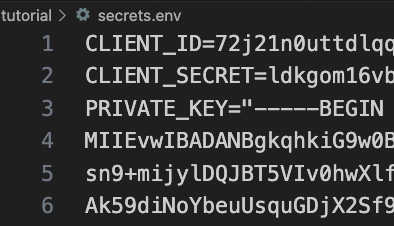
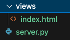
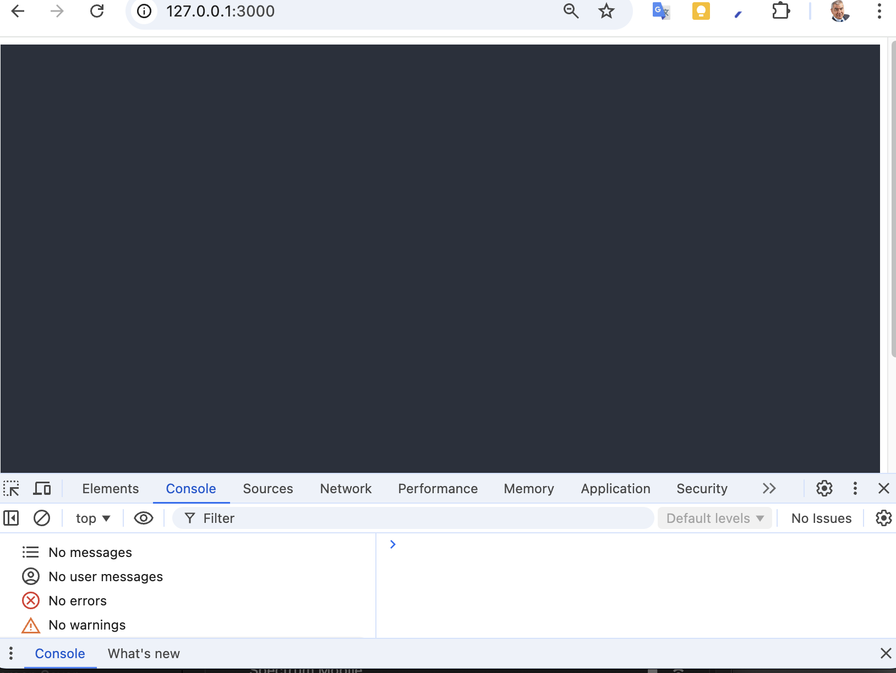

# RICOH360 Viewer Tutorial

## HTML File

Create a barebones HTML file called `index.html`.  Move the file to a sub-folder called, `views`.

```html
<!DOCTYPE html>
<html lang="en">
<head>
    <meta name="viewport" content="width=device-width, initial-scale=1.0">
</head>
<body>
    
</body>
</html>
```

Insert the viewer in the head.

`<script src="https://r360pf-prod-static.s3.us-west-2.amazonaws.com/viewer/v0.15.0/ricoh360-viewer.js"></script>`

In the body, create a div with `id="viewer"`.

```html
<div
style="
    position: relative;
    width: 100%;
    height: 650px;
    background-color: #2a303c;
"
>
<div id="viewer"></div>
</div>
```

### instantiate viewer

In the snippet below, we will pass the token into the `index.html` from
Flask.

```javascript
  <script>
  const viewer = new RICOH360Viewer({
    divId: "viewer",
    onFetchToken: () => "{{token}}",
  });
</script>
```

At this stage, the `views/index.html` file looks like this.

```html
<!DOCTYPE html>
<html lang="en">
<head>
    <meta name="viewport" content="width=device-width, initial-scale=1.0">
    <script src="https://r360pf-prod-static.s3.us-west-2.amazonaws.com/viewer/v0.15.0/ricoh360-viewer.js"></script>
</head>
<body>
    <div
    style="
      position: relative;
      width: 100%;
      height: 650px;
      background-color: #2a303c;
    "
  >
    <div id="viewer"></div>
  </div>
  <script>
  const viewer = new RICOH360Viewer({
    divId: "viewer",
    onFetchToken: () => "{{token}}",
  });
</script>

</body>
</html>
```

The viewer can't be instantiated because it needs a token.

## secrets.env

Using the following information obtained from RICOH, create
a `secrets.env` file.

1. Client ID
1. Client Secrete
1. Private Key



## Python file

Create a new python file in the same directory called `server.py` in the
same directory as the `views` folder.  It is one level higher than
the `index.html` file.



Create virtual environment.

`python -m venv venv`

Install dependencies.

`pip install PyJWT Flask python-dotenv requests`

Add skeleton flask server code.

```python
from flask import Flask, render_template
import jwt
import os
from dotenv import load_dotenv

load_dotenv("secrets.env")

app = Flask(__name__)
app.template_folder = "views"
app.static_folder = "public"

# Retrieve environment variables
PRIVATE_KEY = os.getenv("PRIVATE_KEY")
CLIENT_ID = os.getenv("CLIENT_ID")
CLIENT_SECRET = os.getenv("CLIENT_SECRET")


@app.route("/")
def index():
    return render_template("index.html")


if __name__ == "__main__":
    app.run(port=3000, debug=True)
    print("Open browser at http://localhost:3000 or http://127.0.0.1:3000")
    
```

At this stage, if you open the browser, you will just have a black screen.  You won't be able to see the image because you still need to
pass the viewer the `token` and the `contentId`



### creating the token for the RICOH360 Viewer

Install `cryptography` to generate token.

`pip install cryptography`

Create the method `create_token` above the route.

```python

def create_token():
    payload = {"client_id": CLIENT_ID}
    token = jwt.encode(payload, PRIVATE_KEY, algorithm="RS256")
    # Decode to UTF-8 if necessary

    return token if isinstance(token, str) else token.decode("utf-8")
```

Pass the token to the HTML page.

```python
@app.route("/")
def index():
    token = create_token()
    return render_template("index.html",  token=token)
```

### accessing content

