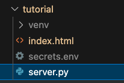

# RICOH360 Viewer Tutorial

## HTML File

Create a barebones HTML file called `index.html`.  Move the file to a sub-folder called, `views`.

```html
<!DOCTYPE html>
<html lang="en">
<head>
    <meta name="viewport" content="width=device-width, initial-scale=1.0">
</head>
<body>
    
</body>
</html>
```

Insert the viewer in the head.

`<script src="https://r360pf-prod-static.s3.us-west-2.amazonaws.com/viewer/v0.15.0/ricoh360-viewer.js"></script>`

In the body, create a div with `id="viewer"`.

```html
<div
style="
    position: relative;
    width: 100%;
    height: 650px;
    background-color: #2a303c;
"
>
<div id="viewer"></div>
</div>
```

### instantiate viewer

In the snippet below, we will pass the token into the `index.html` from
Flask.

```javascript
  <script>
  const viewer = new RICOH360Viewer({
    divId: "viewer",
    onFetchToken: () => "{{token}}",
  });
</script>
```

At this stage, the `views/index.html` file looks like this.

```html
<!DOCTYPE html>
<html lang="en">
<head>
    <meta name="viewport" content="width=device-width, initial-scale=1.0">
    <script src="https://r360pf-prod-static.s3.us-west-2.amazonaws.com/viewer/v0.15.0/ricoh360-viewer.js"></script>
</head>
<body>
    <div
    style="
      position: relative;
      width: 100%;
      height: 650px;
      background-color: #2a303c;
    "
  >
    <div id="viewer"></div>
  </div>
  <script>
  const viewer = new RICOH360Viewer({
    divId: "viewer",
    onFetchToken: () => "{{token}}",
  });
</script>

</body>
</html>
```

The viewer can't be instantiated because it needs a token.

## Python file

Create a new python file in the same directory called `server.py` in the
same directory as the `views` folder.  It is one level higher than
the `index.html` file.



